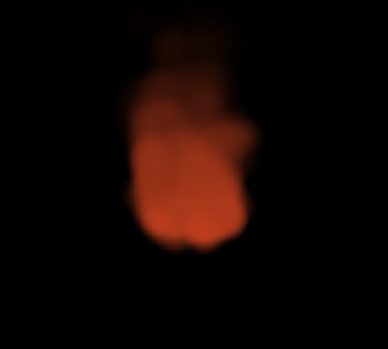

# Cpp-Particle-System

A Particle System than be used in any C++ 17 (or higher) project.

Modified from that of Cocos2dx and forked from [SDL2-particles](https://github.com/scarsty/SDL2-particles).

## Effect Examples

Fire

Snow

## How to use:

**@TODO!!!!**

## LICENSE
[See the LICENSE file](./LICENSE)