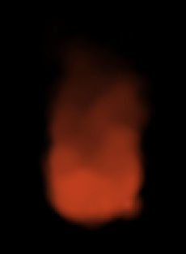
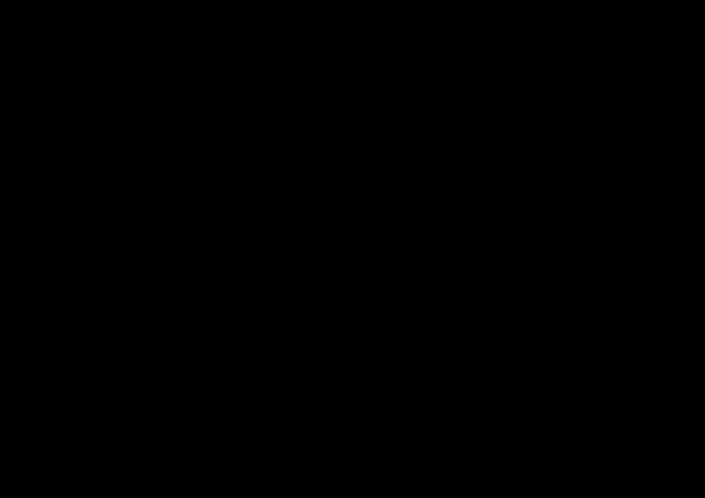
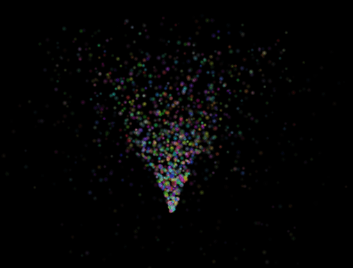
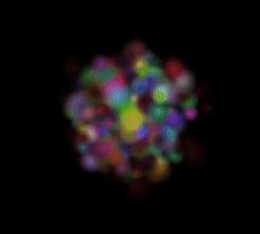
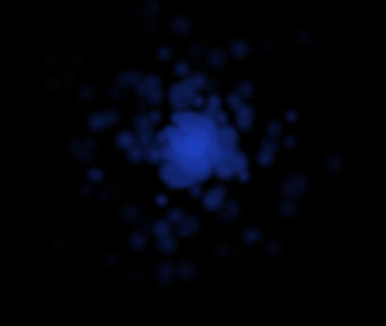
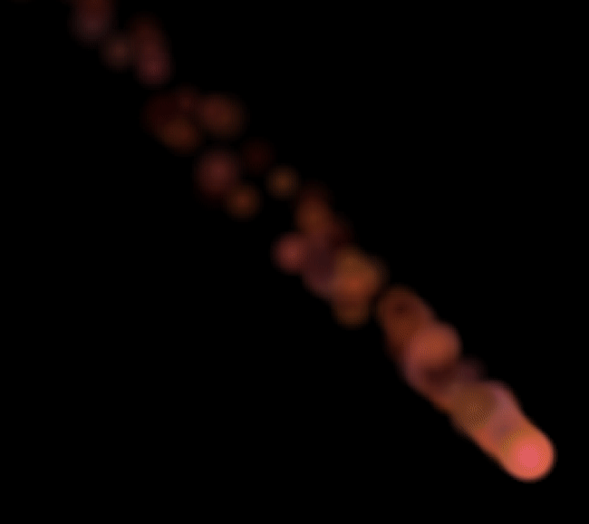
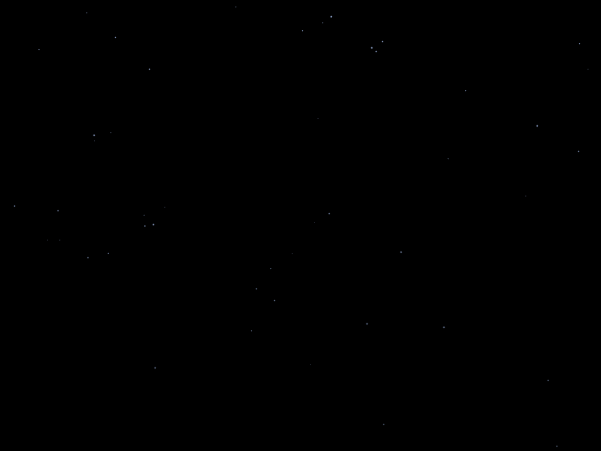
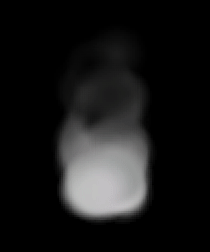
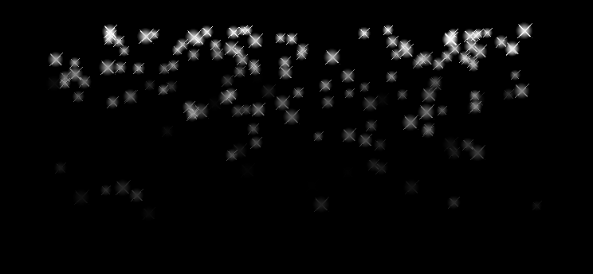

# Cpp-Particle-System

A Particle System than be used in any C++ 17 (or higher) project.

Modified from that of Cocos2dx and forked from [SDL2-particles](https://github.com/scarsty/SDL2-particles).

## Effect Examples
In [ParticleObject.cpp](examples/sdl2/ParticleObject.cpp) you can find how these effects are created.

### Fire

### Explosion

### Firework

### Flower

### Galaxy

### Meteor

### Rain

### Smoke

### Snow

## LICENSE
[See the LICENSE file.](./LICENSE)